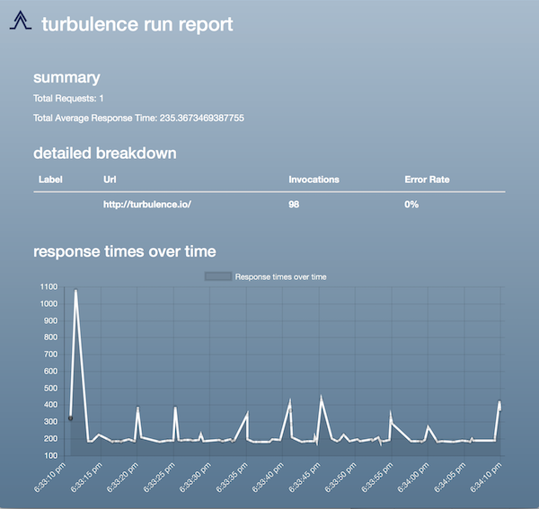

# Turbulence
### Introduction
A plug-in based, distributed performance testing tool *for developers*

[](https://travis-ci.org/njenan/turbulence)
[](https://badge.fury.io/js/turbulence)
[](https://coveralls.io/github/njenan/turbulence?branch=master)
[](https://gitter.im/turbulence-performance-test/Lobby?utm_source=badge&utm_medium=badge&utm_campaign=pr-badge)

### Installation

Install turbulence with npm:

    npm install -g turbulence


### Quick-Start
Turbulence uses a Javascript fluent interface to define test scripts.  Create an empty `my_test_plan.turbulence` file to start, and paste the example code below:

```javascript
turbulence
    .startUserSteps()
        .get('http://turbulence.io/')
        .expectStatus(200)
        .randomPause(2000, 10000)
        .concurrentUsers(10)
        .duration(60000)
    .endUserSteps()
    .run()
```

This will define a test that runs 10 virtual users against the turbulence home page.  The users will pause from 2-10 seconds between every request, and continue for 60 seconds.  The tests can then be run from the command line:
 
    turbulence my_test_plan.turbulence

When turbulence finishes, a `Report.html` file will be created in the current directory.  Open the file in a web browser and you should see the run report:



For convenience, `trb` is also available as an alias for `turbulence` on the command line, so the commands:

    turbulence my_test_plan.turbulence

is equivalent to:

    trb my_test_plan.turbulence


### Contributing
Before submitting a pull request, please make sure that your changes are covered by proper tests, and review the [Style Guide](./STYLE_GUIDE.md).  All code should pass the linter.  Run `npm run all` to run the full regression test suite and linter checks.


### License

Turbulence is licensed under the terms of the [MIT license](./LICENSE).
